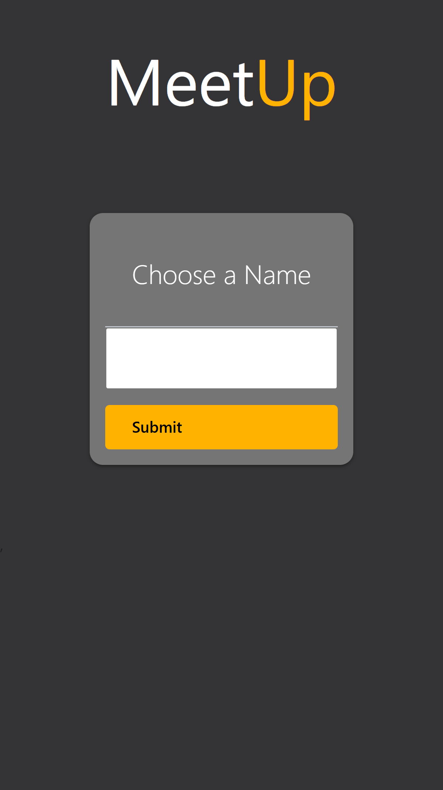
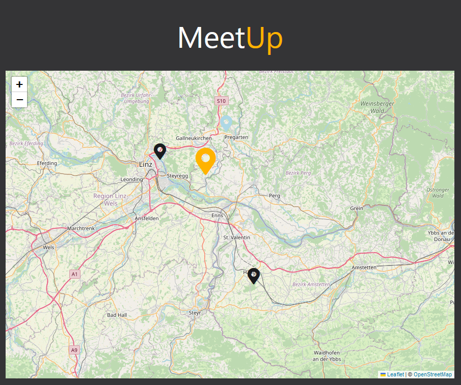

# Meet in the middle

This project features a simple UI that allows to find a meeting point with everybody else that is currently on the
website.

## Implementation

This projects consists of an SPA React app that is built with Vite and a NodeJS/ExpressJS server on the backend.
All communication is done through the websocket protocol.

The state and location of all users is stored in a mongoDB database.